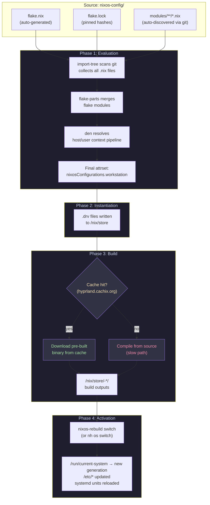
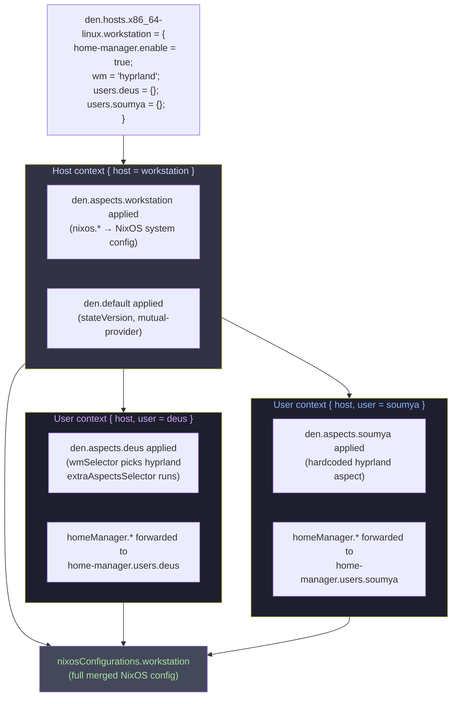
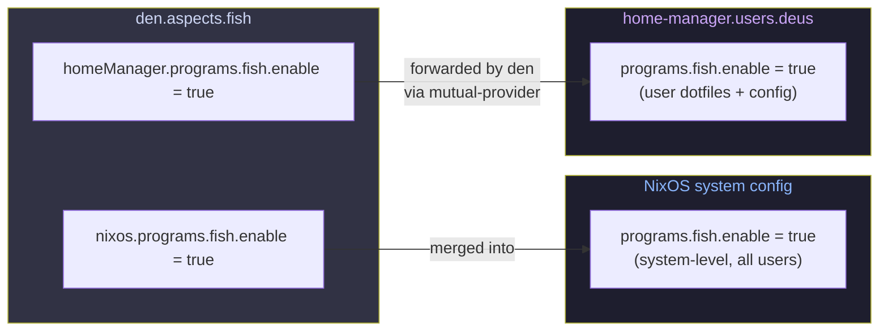

# How Everything Fits Together

This document explains the complete picture — from `.nix` files to a running system.
Useful for both humans and AI agents navigating this codebase.

---

## The Nix store

The `/nix/store` is an immutable, content-addressed storage directory. Every package,
config file, and script lives here as `/nix/store/<hash>-<name>/`. Nothing outside the
store is ever modified by a build (except symlinks in `/run`, `/etc`, `~`).

```
/nix/store/
  abc123-hyprland-0.54.0/    ← a build output
  def456-hyprland-0.54.0.drv ← the build recipe (derivation)
  ghi789-nixos-system-*/     ← the entire NixOS system closure
    activate                  ← script that switches to this generation
    sw/bin/                   ← all binaries
```

**Why this matters for debugging:**
- Packages don't conflict — each lives in its own store path
- Old generations are just old symlinks — `just clean` removes unreferenced paths
- `nix-store -q --references /path/to/thing` shows what a path depends on
- Never try to read source from the store — clone repos to `/tmp` instead

---

## From `.nix` files to a running system



---

## The den context pipeline (zoomed in)



---

## How config from aspects reaches NixOS



---

## File lookup guide (for humans and AI agents)

| You want to... | Look in... |
|---------------|-----------|
| Change a host's packages / services | `modules/hosts/<hostname>/default.nix` |
| Change a user's dotfiles / programs | `modules/aspects/<feature>.nix` (homeManager block) |
| Add a feature to all users | `modules/users/deus.nix` or `soumya.nix` includes |
| Add a feature to one host only | `extraAspects` in the host declaration |
| Change system-level config | `modules/aspects/<feature>.nix` (nixos block) |
| Add a new flake input | inline `flake-file.inputs` in the relevant aspect file |
| Change Neovim config | `modules/aspects/nvim/` |
| Change Hyprland config | `modules/aspects/hyprland/` |
| Change theming | `modules/aspects/appearance.nix` |
| Change secrets | `sops secrets/<name>.yaml` |
| See what `host.wm` etc. means | `modules/schema.nix` |
| Understand what runs on each host | `modules/hosts/<hostname>/default.nix` includes list |

---

## Why AI agents sometimes look in the wrong places

**`/nix/store`** — agents sometimes try to read package source from here. Don't. The
store has compiled outputs, not source. Clone the repo to `/tmp` instead.

**`nix eval`** — causes a RAM spike on large flakes. Use `just dry` or `just repl`.

**`flake.nix`** — agents sometimes try to edit it. It's auto-generated. Edit the
relevant `modules/` file instead, then run `just write-flake`.

**`imports = [...]`** — agents from other NixOS configs expect explicit import lists.
This config uses `import-tree` — there are no import lists. New files just need
`git add`.

---

## Secrets (sops-nix)

Secrets are YAML files encrypted with age keys. Keys are safe to see in plaintext,
values are encrypted.

```
secrets/
  common.yaml        # shared across all hosts (github_token, etc.)
  deus.yaml          # deus's SSH key + password (all hosts)
  soumya.yaml        # soumya's SSH key + password
  rclone.yaml        # rclone config (personal + thinkpad only)
```

Each host decrypts secrets using its SSH host key — sops-nix derives an age key from
`/etc/ssh/ssh_host_ed25519_key` automatically. No manual age key file needed.

Edit secrets: `sops secrets/deus.yaml` (decrypts, opens editor, re-encrypts on save).

---

## Generation management

NixOS keeps every past system build as a "generation". Each generation is a complete
system closure in the store.

```bash
just history     # list generations
just clean       # remove old ones (GC)
```

If something breaks after `just install`, you can boot into the previous generation
from the bootloader menu (it's still in the store until cleaned).
