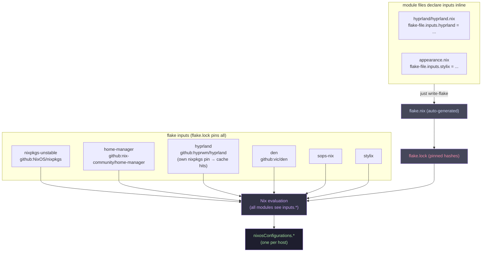

# Flakes, flake-parts, and flake-file

---

## What is a flake?

A flake is a Nix project with a standardised interface. It lives in a directory with a
`flake.nix` file that declares:

- **`inputs`** — other flakes this one depends on (like package.json dependencies)
- **`outputs`** — what this flake produces (NixOS configs, packages, dev shells, etc.)

```nix
{
  inputs = {
    nixpkgs.url = "github:NixOS/nixpkgs/nixos-unstable";
    home-manager.url = "github:nix-community/home-manager";
    home-manager.inputs.nixpkgs.follows = "nixpkgs";  # reuse our nixpkgs
  };

  outputs = { nixpkgs, home-manager, ... }: {
    nixosConfigurations.mymachine = nixpkgs.lib.nixosSystem {
      modules = [ ./configuration.nix ];
    };
  };
}
```

---

## `flake.lock`

Like `package-lock.json`. Pins every input to an exact git commit and hash. Committed
to the repo so builds are reproducible.

```bash
nix flake update            # update all inputs to latest
nix flake update nixpkgs    # update one input
just up                     # update all + rebuild
just upp i=home-manager     # update one + rebuild
```

After updating, Nix re-resolves all hashes and rewrites `flake.lock`. Always commit
`flake.lock` together with `flake.nix`.

---

## `inputs.X.follows`

Makes one input's sub-dependency use your version instead of its own pinned version.

```nix
home-manager.inputs.nixpkgs.follows = "nixpkgs";
```

This means HM uses your `nixpkgs` pin, not its own. Reduces duplication in the store.

**Tradeoff:** If a package's CI cache is built against its own pinned nixpkgs, `follows`
changes the store hashes → cache misses → local compilation. See `hyprland` in this config
— we removed `follows` to get cache hits.

---

## flake-parts

`flake.nix` has no built-in module system — you'd write all outputs by hand. `flake-parts`
adds a NixOS-style module system to flakes themselves.

Instead of one giant `outputs = { ... }:` function, you write modules that each contribute
to `flake.parts`:

```nix
# Without flake-parts (messy)
outputs = inputs@{ nixpkgs, ... }: {
  nixosConfigurations = { ... };
  devShells = { ... };
  packages = { ... };
};

# With flake-parts (modular)
outputs = inputs: flake-parts.lib.mkFlake { inherit inputs; } {
  imports = [ ./module-a.nix ./module-b.nix ];
};
# Each imported module contributes its piece of the outputs
```

In this config, `den.nix` bootstraps flake-parts and `import-tree` does the module
discovery. You never interact with flake-parts directly.

---

## flake-file

`flake-file` is a flake-parts module that lets you declare flake inputs **inline inside
any module file**, rather than centralising them in `flake.nix`.

```nix
# modules/aspects/hyprland/hyprland.nix
{ den, ... }:
{
  flake-file.inputs.hyprland = {
    url = "github:hyprwm/hyprland";
    # inputs.nixpkgs.follows = "nixpkgs-unstable";  # removed for cache hits
  };

  den.aspects.hyprland = { ... };
}
```

`flake-file` collects all these inline declarations and regenerates `flake.nix`. Run
`just write-flake` any time you add, remove, or change an input.

**`flake.nix` is auto-generated — never edit it by hand.**

---

## How inputs flow through this config



---

## The unstable overlay

`schema.nix` applies an overlay that makes the unstable nixpkgs available everywhere as
`pkgs.unstable.*`:

```nix
nixpkgs.overlays = [(final: prev: {
  unstable = import inputs.nixpkgs-unstable { inherit (prev) system; config.allowUnfree = true; };
})];
```

So in any aspect you can do:

```nix
home.packages = [ pkgs.git pkgs.unstable.some-new-package ];
```

No extra imports needed — `pkgs.unstable` is always there.

---

## Adding a new flake input

1. Declare it inline in whichever module needs it:

```nix
flake-file.inputs.my-input = {
  url = "github:owner/repo";
  inputs.nixpkgs.follows = "nixpkgs-unstable";   # optional
};
```

2. Regenerate `flake.nix`:

```bash
just write-flake
```

3. Stage and commit both files together:

```bash
git add flake.nix flake.lock modules/aspects/whatever.nix
git commit -m "add my-input"
```
