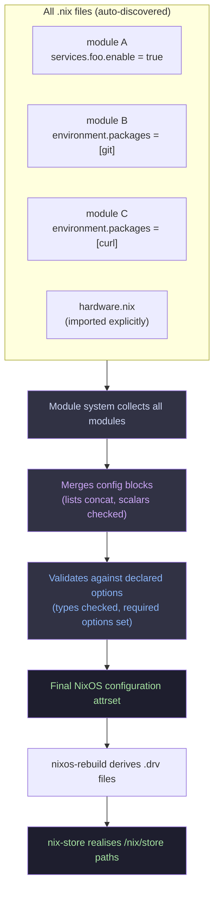

# NixOS Module System

The module system is how NixOS lets hundreds of `.nix` files coexist and combine into
one coherent system configuration. It's the layer between raw Nix and the OS.

---

## What is a module?

A module is a Nix file that returns an attrset (or a function returning an attrset) with
a specific shape:

```nix
# Function form — use when you need pkgs/lib/config/options
{ config, pkgs, lib, ... }:
{
  imports = [ ./other-module.nix ];   # pull in other modules
  options = { ... };                  # declare new options
  config = { ... };                   # set option values
}

# Shorthand — config.* is implicit when no options/imports needed
{ pkgs, ... }:
{
  environment.systemPackages = [ pkgs.git ];
  services.openssh.enable = true;
}
```

The module system collects ALL modules, merges their `config` blocks, validates
against declared `options`, and produces the final system configuration.

---

## Options vs Config

**`options`** — declares that a value exists and what type it should be. Like a schema.

```nix
options.myapp.enable = lib.mkOption {
  type = lib.types.bool;
  default = false;
  description = "Whether to enable myapp.";
};

options.myapp.port = lib.mkOption {
  type = lib.types.port;   # 1-65535
  default = 8080;
};
```

**`config`** — sets values for options that exist (either declared here or by another module).

```nix
config.myapp.enable = true;
config.services.nginx.enable = true;
```

When there are no `options` or `imports` keys, you can skip writing `config =` — the
whole attrset is treated as config directly (shorthand form).

---

## How modules merge

The module system collects every module and merges them together. **Most merges are
automatic** — you rarely need to think about conflicts.

| Value type | Merge behaviour |
|-----------|----------------|
| `bool` | Error on conflict (use `mkForce`/`mkDefault` to resolve) |
| `string` | Error on conflict |
| `list` | Concatenated — `[ "a" ]` + `[ "b" ]` → `[ "a" "b" ]` |
| `attrset` | Recursively merged |
| `null` or unset | Falls through to the option's `default` |

```nix
# module A
environment.systemPackages = [ pkgs.git ];

# module B
environment.systemPackages = [ pkgs.curl ];

# result — lists are automatically combined
environment.systemPackages = [ pkgs.git pkgs.curl ];
```

---

## Priority overrides

When two modules set the same scalar option, Nix errors. Use priorities to resolve:

```nix
lib.mkDefault value    # priority 1000 — lowest, intended as a fallback
# (no wrapper)         # priority 100  — normal
lib.mkForce value      # priority 50   — highest, overrides everything
```

```nix
# schema.nix sets a default
services.foo.port = lib.mkDefault 8080;

# your config overrides it (no wrapper needed — normal beats mkDefault)
services.foo.port = 9090;

# force override even an explicit set in another module
services.foo.port = lib.mkForce 9090;
```

---

## `config.*` — reading the final merged value

Inside a module, `config.*` lets you read the final merged value of *any* option.
This is how modules depend on each other:

```nix
{ config, lib, pkgs, ... }:
{
  # Only install extra tools if openssh is enabled
  environment.systemPackages = lib.optionals config.services.openssh.enable [
    pkgs.mosh
  ];
}
```

> **Infinite recursion warning:** If module A's config depends on option X, and module B
> sets option X based on module A's config, you get infinite recursion. Nix will tell you.
> The fix is usually `lib.mkDefault` or restructuring.

---

## `imports`

Pulls other module files into the current evaluation. The imported module merges with
everything else — there's no hierarchy.

```nix
{ imports = [ ./hardware.nix ./users.nix ]; }
```

In this config, `import-tree` replaces manual `imports` lists — it auto-discovers all
`.nix` files in `modules/` via git. You only use explicit `imports` for `_`-prefixed
files (hardware configs, disko, etc.) that are intentionally excluded from auto-discovery.

---

## Common option types

```nix
lib.types.bool
lib.types.str
lib.types.int
lib.types.port             # int 1–65535
lib.types.path
lib.types.package          # a derivation
lib.types.listOf lib.types.str
lib.types.attrsOf lib.types.str
lib.types.nullOr lib.types.str   # str or null
lib.types.enum [ "a" "b" "c" ]
lib.types.submodule { options = { ... }; }   # nested module
```

---

## Module merge flowchart



---

## Reading error messages

NixOS module errors look like this:

```
error: The option `services.foo.port' has conflicting definition values:
  - In `/nix/store/.../module-a.nix': 8080
  - In `/nix/store/.../module-b.nix': 9090
```

The fix is almost always `lib.mkDefault` on the less-important one.

For evaluation errors:

```
error: attribute 'bar' missing
at /nix/store/.../foo.nix:12:5
while evaluating 'config.services.foo'
while evaluating the NixOS option 'services.foo.enable'
```

Read **bottom-up** — the bottom line is the root cause (missing attribute `bar`).
The top line is just the context chain showing you how evaluation got there.

---

## Home Manager modules

Home Manager is a separate module system that runs *within* a user context. It follows
exactly the same pattern — modules, options, config blocks, imports — but the options
tree starts at `programs.*`, `services.*`, `home.*` etc. instead of NixOS's `services.*`,
`environment.*`, etc.

The key distinction in this config:
- `nixos.*` in an aspect → goes to NixOS system config
- `homeManager.*` in an aspect → goes to Home Manager for each user
